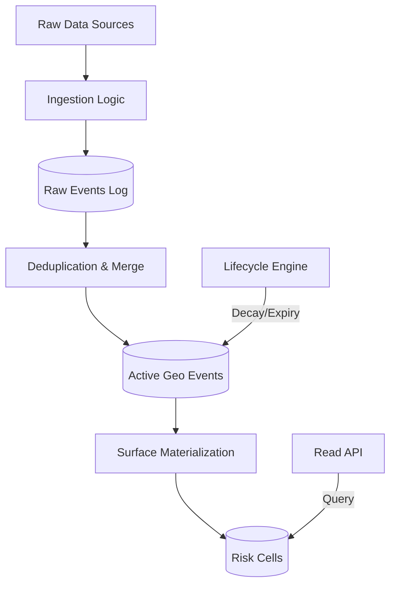

# UDIE — Urban Disruption Intelligence Engine

UDIE is a full-stack geospatial intelligence project focused on disruption-aware routing for urban environments.
It combines an iOS client with a backend API and a PostGIS database to map disruption events and compute route risk server-side.

> [!TIP]
> **New Documentation Suite**: Comprehensive project details, architecture, and roadmaps are now available in the [Documentation Index](docs/INDEX.md).

This repository is kept open source for learning, review, and extension.

## Project Report

### 1. Problem Statement
Traditional map navigation focuses on speed/ETA but does not explicitly model infrastructure disruptions (accidents, road blocks, construction, etc.) as a structured risk layer.

UDIE addresses this by:
- collecting and serving geospatial events,
- querying events by map region,
- computing route risk from spatial proximity and event severity/confidence,
- exposing that intelligence to a mobile UI.

### 2. Solution Summary
UDIE follows a backend-authoritative architecture:
- **iOS Client**: Refactored for modularity using reusable components (`RiskCardView`, `StatusBadgeView`). It sends route geometry and map region bounds.
- **Backend API**: Performs spatial computation using PostGIS and returns normalized intelligence.
- **Dynamic Context**: Supports dynamic city switching and location-aware risk scoring.

### 3. Architecture: The Weather Model
UDIE behaves like a weather model rather than a standard CRUD API. It maintains a **continuously updated spatial risk field** derived from noisy real-world signals.



#### Core Components
- **Append-Only Log**: Immutable source of truth in `events_log`.
- **Active State (`geo_events`)**: Decaying spatial projection with H3 Resolution 9 indices.
- **Materialized Surface (`risk_cells`)**: Pre-aggregated weights for $O(route\_cells)$ query performance.
- **Lifecycle Service**: Automated 3% confidence decay every 15 minutes.

### 4. Technologies Used
- **Languages**: Swift, TypeScript, SQL (PL/pgSQL).
- **Frameworks**: NestJS, SwiftUI, MapKit, PostGIS, H3-PG.
- **Infrastructure**: PostgreSQL, Docker, Redis.

### 5. What Is Implemented
- [x] **Hardened Schema**: H3-indexed active events with temporal decay.
- [x] **Append-Only Ingestion**: Raw log replayability for 100% state recovery.
- [x] **Materialized Read Path**: Risk scoring via `risk_cells` (O(cells) complexity).
- [x] **Lifecycle Automation**: Background jobs for confidence decay and expiry.
- [x] **Geometric Guards**: Route complexity bounding (50km/1000 vertices).
- [x] **iOS Map Client**: Modular SwiftUI components for real-time risk visualization.

### 6. Risk Model (Formalized v2)
Route risk is computed using an exponential distance decay field:

**Equation:**
$$ R_{raw} = \sum (W_{cell} \cdot e^{-d/\lambda}) $$
- **λ (Lambda)**: 250m decay constant.
- **Normalization**: $1 - exp(-R_{raw} / 20.0)$ (Sigmoid 0.0 - 1.0).
- **Complexity**: $O(route\_cells)$ — latency is decoupled from total event history.

---

### 7. Open Source Setup

## Prerequisites
- macOS + Xcode
- Docker Desktop
- Node.js + npm

## Clone
```bash
git clone git@github.com:fallofpheonix/UDIE.git
cd UDIE
```

## Backend Run
```bash
cd backend
npm install
docker-compose up -d --build
```

## iOS Run
- Open `UDIE.xcodeproj` in the root directory.
- Run `UDIE` target on simulator or device.

---

### 8. Production Roadmap (The 6-Sprint Cycle)
1. **Sprint 0: Foundation [DONE]**: Log, H3, Lifecycle, Materialization.
2. **Sprint 1: Verification [PROGRESS]**: Scale Proof and Model Fidelity audit.
3. **Sprint 2: Stabilization**: Managed jobs, Telemetry, and Ingestion smoothing.
4. **Sprint 3: Scaling**: H3 Spatial Partitioning and Regional Scoping.
5. **Sprint 4: Multi-Node**: Role separation (Ingest/Agg/Read) + Advisory Locks.
6. **Sprint 5: Saturation**: Empirical bottleneck identification and stress testing.

### 9. Documentation Index
- [Implementation Plan](docs/ROADMAP.md): Detailed 6-sprint technical journey.
- [Architecture Details](docs/ARCHITECTURE.md): Deep dive into the data pipeline.
- [Guardrails](docs/GUARDRAILS.md): The 20 Atomic Laws of UDIE.
- [Risk Model](docs/RISK_MODEL.md): Mathematical specification of scores.

### 13. Contribution
PRs/issues are welcome for:
- data ingestion connectors,
- risk algorithm improvements,
- UX/accessibility improvements,
- testing and reliability hardening.

### 14. License
This project is open source. Add a `LICENSE` file (`MIT` recommended) for explicit reuse terms.
