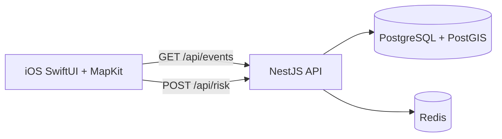

# UDIE — Urban Disruption Intelligence Engine

UDIE is a full-stack geospatial intelligence project focused on disruption-aware routing for urban environments.
It combines an iOS client with a backend API and a PostGIS database to map disruption events and compute route risk server-side.

This repository is kept open source for learning, review, and extension.

## Project Report

### 1. Problem Statement
Traditional map navigation focuses on speed/ETA but does not explicitly model infrastructure disruptions (accidents, road blocks, construction, etc.) as a structured risk layer.

UDIE addresses this by:
- collecting and serving geospatial events,
- querying events by map region,
- computing route risk from spatial proximity and event severity/confidence,
- exposing that intelligence to a mobile UI.

### 2. Solution Summary
UDIE follows a backend-authoritative architecture:
- iOS sends route geometry and map region bounds,
- backend performs spatial computation using PostGIS,
- iOS renders results (events, route, risk card).

This prevents logic duplication and keeps scoring consistent.

### 3. Architecture



#### Frontend
- SwiftUI views for map, filters, route planner, risk display
- `MapViewModel` for state orchestration
- `APIClient` for backend communication
- `MKMapView` wrapper for clustering + overlays

#### Backend
- NestJS modular API (`events`, `risk`, `health`, ingestion scaffold)
- DTO validation for query/body safety
- SQL/PostGIS powered risk function

#### Data Layer
- PostgreSQL with PostGIS extensions
- Spatial indexing for performant geographic queries

### 4. Technologies Used

#### Languages
- Swift
- TypeScript
- SQL / PLpgSQL
- YAML
- Shell

#### Frameworks and Libraries
- SwiftUI
- MapKit
- Combine
- UIKit (haptics/interoperability)
- NestJS
- class-validator

#### Databases and Infra
- PostgreSQL
- PostGIS
- Redis
- Docker / Docker Compose

#### Tooling
- Xcode
- Git / GitHub
- curl

### 5. What Is Implemented

#### Completed
- iOS map rendering and event clustering
- Route planning and route overlay rendering
- Server-side risk API integration in iOS
- Region-based event fetch from backend
- Risk card with severity levels
- Basic UX hardening (retry action, clear route action, loading/empty states)
- Dockerized backend stack
- Health endpoint and validation path

#### In Progress / Scaffolded
- Multi-source ingestion pipeline
- deeper production hardening (auth, rate limiting, observability)

### 6. Risk Model (Current)
Route risk is computed server-side from nearby events:

- filter events near route geometry,
- weight each event by `severity * confidence`,
- apply distance decay,
- normalize to score and map to `LOW | MEDIUM | HIGH`.

### 7. Open Source Setup

## Prerequisites
- macOS + Xcode
- Docker Desktop
- Git

## Clone
```bash
git clone git@github.com:fallofpheonix/UDIE.git
cd UDIE
```

## Backend Run
```bash
cd backend
cp .env.example .env
docker compose up -d --build
```

## Backend Health
```bash
curl http://localhost:3000/api/health
```
Expected:
```json
{"status":"ok","db":"up"}
```

## iOS Run
- Open `/Users/fallofpheonix/ios_swift/UDIE/UDIE.xcodeproj`
- Run `UDIE` target on simulator or device

For physical iPhone, set base URL to your Mac LAN IP:
- key: `UDIE_API_BASE_URL`
- value: `http://<your-mac-ip>:3000`

### 8. API Contracts

#### `GET /api/health`
Service + DB status.

#### `GET /api/events`
Query params:
- `minLat`, `maxLat`, `minLng`, `maxLng` (required)
- `city` (recommended)
- optional filters: type/severity

#### `POST /api/risk`
Request:
```json
{
  "city": "DEL",
  "coordinates": [
    {"lat": 28.6139, "lng": 77.2090},
    {"lat": 28.6150, "lng": 77.2110}
  ]
}
```

Response:
```json
{
  "score": 0.48,
  "level": "MEDIUM",
  "eventCount": 3
}
```

### 9. Demo Checklist
Before demo:
1. Start Docker backend.
2. Verify health endpoint.
3. Verify events endpoint returns rows for current city.
4. Run iOS app.
5. Use route preset and show risk update.

### 10. Troubleshooting

#### Backend timeout on iPhone
- ensure Mac + iPhone are on same network,
- verify iPhone Safari can open `http://<mac-ip>:3000/api/health`,
- update `UDIE_API_BASE_URL` accordingly.

#### Docker daemon error
Start Docker Desktop and wait for engine running.

#### Git push SSH error
```bash
eval "$(ssh-agent -s)"
ssh-add --apple-use-keychain ~/.ssh/id_ed25519
ssh -T git@github.com
git push origin main
```

### 11. Known Limitations
- Ingestion pipeline is scaffolded, not fully automated.
- Production auth/rate limiting not finalized.
- Model is heuristic, not predictive ML.

### 12. Roadmap
- ingestion automation and deduplication
- time-decay and historical trend modeling
- observability (metrics, logs, tracing)
- secure production configuration

### 13. Contribution
PRs/issues are welcome for:
- data ingestion connectors,
- risk algorithm improvements,
- UX/accessibility improvements,
- testing and reliability hardening.

### 14. License
This project is open source. Add a `LICENSE` file (`MIT` recommended) for explicit reuse terms.
