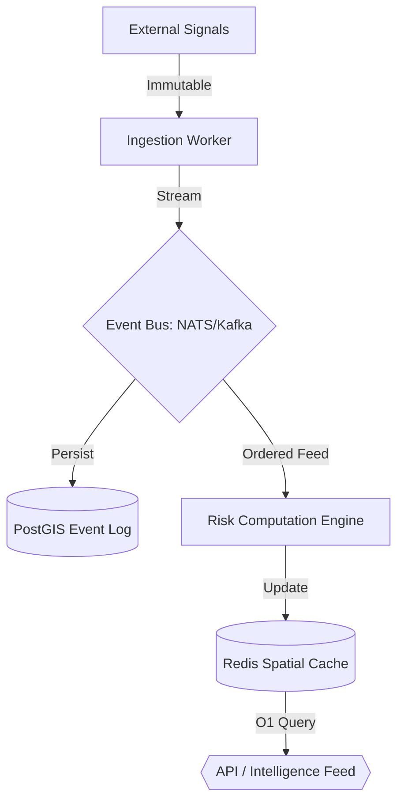

# 🌪️ UDIE — Urban Disruption Intelligence Engine

**UDIE** is a next-generation spatial intelligence substrate that models urban disruption as a continuously evolving, deterministic risk field. By ingesting diverse real-world signals, UDIE provides a mathematically-grounded view of city-wide disruptions, exposing a high-performance API for real-time risk evaluation.

---

> [!IMPORTANT]
> **Architectural Integrity**: This is a geospatial computation layer, not a simple navigation app. It is designed for maximum determinism, observability, and sub-millisecond scaling.

---

## 🏛️ System Architecture (v2.0)

UDIE operates on a **Spatial Event Sourcing** philosophy, treating the urban landscape as a spatiotemporal scalar risk field.


```mermaid
graph TD
    Signals[External Signals] -- "Immutable" --> Ingest[Ingestion Worker]
    Ingest -- "Stream" --> Bus{Event Bus: NATS/Kafka}
    Bus -- "Persist" --> DB[(PostGIS Event Log)]
    Bus -- "Ordered Feed" --> Engine[Risk Computation Engine]
    Engine -- "Update" --> Cache[(Redis Spatial Cache)]
    Cache -- "O1 Query" --> Consumer{{API / Intelligence Feed}}
```

### 💎 Key Invariants
- **Deterministic Replay**: The entire system state can be recreated from the authoritative `events_log`.
- **Bounded Cost**: API query performance is $O(\text{route\_cells})$, independent of total event volume.
- **Event Log as Truth**: All risk grids are derived projections; the Event Log is the only persistent authority.

---

## 🗺️ Repository Map & Navigation

UDIE is organized into decoupled layers for scalability and maintainable intelligence.

| Directory | Layer | Description |
| :--- | :--- | :--- |
| [`engine-backend/`](engine-backend/) | **Substrate** | NestJS/PostGIS spatial compute engine. |
| [`UDIE/`](UDIE/) | **Client** | Swift iOS operational interface. |
| [`docs/`](docs/) | **Contract** | Specifications, specifications, and protocols. |
| [`infra/`](infra/) | **Infrastructure** | Docker-compose, PG/Redis configs, & Monitoring. |
| [`scripts/`](scripts/) | **Automation** | Deployment, diagnostics, and operational tools. |

---

## 📖 Documentation Substrate

### 🏗️ 1. Architecture
- [**System Workflow**](docs/architecture/system_workflow.md) — Request lifecycle and data propagation.
- [**Mathematical Appendix**](docs/architecture/MATHEMATICAL_APPENDIX.md) — Formal derivations and stability proofs.
- [**Roadmap**](docs/architecture/ROADMAP.md) — Our **8-Phase Strategic Evolution**.
- [**Structure Spec**](docs/architecture/REPOSITORY_STRUCTURE.md) — Directory laws and ownership.

### ⚙️ 2. Operations
- [**API Spec**](docs/operations/API.md) — REST & WebSocket interface definitions.
- [**Operational Playbook**](docs/operations/PLAYBOOK.md) — Recovery, scaling, and maintenance SOPs.
- [**Setup & Onboarding**](docs/operations/SETUP.md) — Bootstrapping the local environment.
- [**Integrity Report**](docs/operations/INTEGRITY_REPORT.md) — 4-layer system verification status.

### 🤖 3. Agents & Governance
- [**Agent Protocol**](docs/agents/AGENTS.md) — Mandatory procedures for AI/Autonomous contributors.
- [**Diagnostic Workflow**](docs/agents/DIAGNOSTIC_PROTOCOL.md) — Layered troubleshooting strategy.

---

## 🚀 Quick Start

Spin up the entire UDIE substrate in minutes using Docker.

```bash
# 1. Boot the engine
cd infra
docker-compose up -d --build

# 2. Verify System Integrity (Mandatory)
./scripts/verify-full-system-integrity.sh

# 3. Agent Bootstrap (If using autonomous tools)
./scripts/agent-bootstrap.sh
```

---

MIT © 2026 **UDIE Engineering Group**. 
"Stability is a function of structure. Intelligence is a function of stability."
