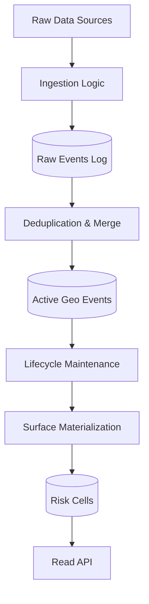

# UDIE Technical Architecture

UDIE follows a "Weather Model" architecture for spatial risk approximation. It prioritizes data freshness, deterministic recomputation, and bounded query cost.

## The Data Pipeline

## Core Components

### 1. Ingestion Log (`events_log`)
The immutable source of truth. Every incoming observation is persisted here before any processing.
- **Rule**: System state must be 100% rebuildable from this log.

### 2. Active State (`geo_events`)
The current decaying projection of reality.
- **Columns**: `h3_index`, `confidence`, `status`, `ST_Point`.
- **Deduplication**: Spatial-temporal merge ($25m$, $30min$, same type).

### 3. Materialized Surface (`risk_cells`)
The pre-aggregated spatial weights at H3 Resolution 9.
- **Query Optimization**: `/risk` API queries *only* this table.
- **Complexity**: $O(route\_cells)$, ensuring latency is independent of total event history.

### 4. Lifecycle Engine
Continuously applies confidence decay (e.g., 3% every 15m) and expires events below threshold.
- **Mechanism**: NestJS scheduled workers calling deterministic SQL functions, with advisory locks for restart safety.

---

## Scaling Axis: Geography
UDIE scales by partitioning the spatial field by H3 parent cells.
- **Region Isolation**: Load in Region A does not affect resources in Region B.
- **Role Isolation**: Ingestion, Materialization, and Reads are logically separated.

---

## Continuous Engineering Discipline
- **Weekly Rebuilds**: Dropping derived tables and replaying the log.
- **Plan Locking**: Auditing `EXPLAIN ANALYZE` for sequential scan regression.
- **Saturation Analysis**: Identifying bottlenecks before scaling.
- **Automated Checks**: `validate:rebuild`, `validate:plan`, and `test:risk` as pre-merge gates.
