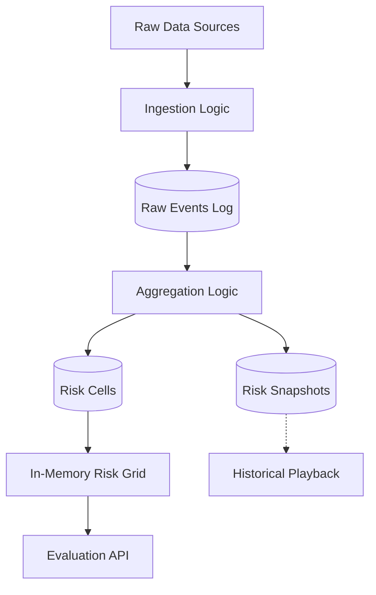

# UDIE Technical Architecture

UDIE follows a "Weather Model" architecture for spatial risk approximation. It prioritizes data freshness, deterministic recomputation, and bounded query cost.

## The Data Pipeline

```mermaid
graph TD
    A[Raw Data Sources] --> B[Ingestion Logic]
    B --> C[(Raw Events Log)]
    C --> D[Aggregation Logic]
    D --> E[(Risk Cells)]
    E --> F[In-Memory Risk Grid]
    F --> G[Evaluation API]
    D --> H[(Risk Snapshots)]
    H -.-> I[Historical Playback]
```

## Core Components

### 1. Ingestion Log (`events_log`)
The immutable source of truth. Every incoming observation is persisted here before any processing.
- **Rule**: System state must be 100% rebuildable from this log.
- **Partitioning**: Partitioned by H3 resolution 6 parents for geographical scaling.

### 2. Aggregation Logic (Sliding Window)
Replaces the old lifecycle maintenance. Risk is computed directly from the log within a moving temporal window (e.g., 6 hours).
- **Decay**: Temporal decay is applied during aggregation ($W = \sum severity \cdot e^{-decay \cdot age}$).
- **Density**: Spatial density amplification ($1 + \alpha \cdot \log(1+N)$) is applied to capture clustering.

### 3. Materialized Surface (`risk_cells`)
The pre-aggregated spatial weights at H3 Resolution 9.
- **Query Optimization**: `/risk` API queries *only* this table.
- **Complexity**: $O(route\_cells)$, ensuring latency is independent of total event history.
- **In-Memory Sync**: Changes to `risk_cells` are pushed to an in-memory grid for ultra-low latency lookups.

### 4. Risk Snapshots (`risk_snapshots`)
Periodic captures of the `risk_cells` surface (every 5 minutes) to enable historical playback and time-lapse visualization.

---

## Scaling Axis: Geography
UDIE scales by partitioning the spatial field by H3 parent cells.
- **Region Isolation**: Load in Region A does not affect resources in Region B.
- **Role Isolation**: Ingestion, Materialization, and Reads are logically separated.

---

## Continuous Engineering Discipline
- **Weekly Rebuilds**: Dropping derived tables and replaying the log.
- **Plan Locking**: Auditing `EXPLAIN ANALYZE` for sequential scan regression.
- **Saturation Analysis**: Identifying bottlenecks before scaling.
- **Automated Checks**: `validate:rebuild`, `validate:plan`, and `test:risk` as pre-merge gates.

## Intelligence Read APIs
- `GET /api/v1/city-dashboard`: bounded regional summary (heatmap, hotspot clusters, incidents, trend).
- `GET /api/v1/cell-insight`: single-cell explainability payload (risk, reliability, forecast, recent history).
- `GET /api/v1/risk-snapshots`: time-windowed snapshot playback on H3-filtered bbox.

## Self-Diagnosis Layer
- `ArchitectureAuditService`: periodic invariant verification (`query plans`, `rebuild determinism`, `partition isolation`, `hot-path checks`).
- `QueryPlanMonitor`: explain-plan drift checks and sequential scan detection.
- `RiskModelMonitor`: risk distribution stability checks (mean/stddev/p95/saturation).
- `PerformanceSentinel`: runtime performance snapshots (latency/grid refresh/event throughput/buffer ratio) written to `system_state`.
- `SimulationService`: isolated synthetic event stream (`simulation_events`) for diagnostics and scenario testing, outside production risk pipeline.
