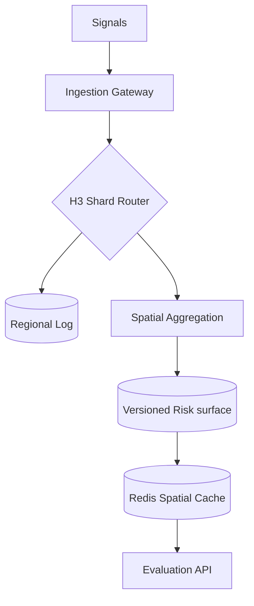

# 🏛️ UDIE: System Architecture & Spatial Design

This document defines the core architecture of the UDIE Spatial Intelligence Engine. The system maintains a continuously evolving spatial disruption field derived from incoming observations and exposed through bounded-cost evaluation APIs.

⸻

## 📖 Core Specification Documents

The technical foundation is defined by the following authoritative documents:

| Document | Description | Repository Path |
| :--- | :--- | :--- |
| **Physics Whitepaper** | Mathematical model (influence, decay, aggregation). | `docs/WHITEPAPER.md` |
| **System Laws** | Non-negotiable architectural constraints. | `docs/LAWS.md` |
| **ADRs** | Design rationale for major decisions. | `docs/ARCHITECTURE.md#ADR` |
| **Limitations** | Explicit boundaries of system guarantees. | `docs/LIMITATIONS.md` |

⸻

## 🏗️ Core Architecture (v3.0): Regional Sharding & Scaling

UDIE implements a **field-based architecture** inspired by atmospheric modeling. The planetary surface is partitioned into independent computational shards.

### ⚡ 1. Spatial Sharding Axis (H3)
UDIE scales horizontally by partitioning the world using the **H3 Hierarchical Index**.
- **Primary Shard Key**: **H3 Resolution 6** (~20km diameter).
- **Partitioning Model**: Database tables are declaratively partitioned (`PARTITION BY LIST`) using the Res 6 parent key.
- **Independence**: Ingestion, Aggregation, and Evaluation workloads are decoupled at the shard boundary, ensuring a "Signal Storm" in Delhi does not impact latencies in New York.

### 🔄 2. The Data Pipeline & Versioning
UDIE follows the **Spatial Event Sourcing** pattern, hardened with **Append-Only Versioning** to prevent MVCC bloat.

### 🧠 3. Risk Computation Engine (The Transformer)
- **KDE Weighting**: Applying kernels ($k=3$) to discrete signals at Resolution 9.
- **Append-Only Persistence**: Instead of `UPDATE` calls on the risk grid, the engine `INSERT`s new versions. This maintains $O(1)$ write speed and enables deterministic historical playback.
- **Temporal Management**: Enforcing decay pulses across versioned shards.

### ⚖️ 4. Consistency & Concurrency Model
- **Semantics**: Eventual Consistency. Sub-second propagation delay.
- **Snapshot Isolation**: Rebuilds use version-stamped snapshots of the `regional_events_log`.
- **Read Isolation**: Primary handles Ingestion/Materialization; Read Replicas handle `/risk` evaluations.

---

## 🛠️ Implementation Details

### Persistence Layer
- **Hot**: Redis (H3 scalar floats for sub-ms lookups). Key: `udie:risk:v1:<h3_index>`.
- **Warm**: PostgreSQL/PostGIS. Partitioned by `h3_parent`.
- **Query Resolution**: API requests resolve the `h3_parent` region first to utilize partition pruning.

### Operational Guarantees
- **Deterministic Replay**: State is exactly $f(\text{log}, \text{params})$.
- **Bounded Evaluation**: Complexity is $O(\text{route\_cells})$.
- **Zero-Contention Path**: Read paths never block write paths.

---

MIT © 2026 **UDIE Engineering Group**. 
"One city, one log, one intelligence."
