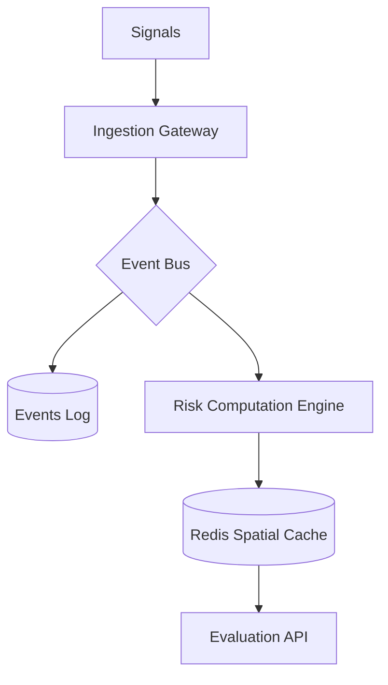

# 🏛️ UDIE: System Architecture & Spatial Design

This document defines the core architecture of the UDIE Spatial Intelligence Engine. The system maintains a continuously evolving spatial disruption field derived from incoming observations and exposed through bounded-cost evaluation APIs.

⸻

## 📖 Core Specification Documents

The technical foundation is defined by the following authoritative documents:

| Document | Description | Repository Path |
| :--- | :--- | :--- |
| **Physics Whitepaper** | Mathematical model (influence, decay, aggregation). | `docs/WHITEPAPER.md` |
| **System Laws** | Non-negotiable architectural constraints. | `docs/LAWS.md` |
| **ADRs** | Design rationale for major decisions. | `docs/ARCHITECTURE.md#ADR` |
| **Limitations** | Explicit boundaries of system guarantees. | `docs/LIMITATIONS.md` |

⸻

## 🏗️ Core Architecture (v2.1): The Event-Sourced Substrate

UDIE implements a **field-based architecture** inspired by atmospheric modeling. Disruption reports act as signals contributing to a continuously evolving spatial field.

---

## 🔄 The Data Pipeline

UDIE follows the **Spatial Event Sourcing** pattern. The `events_log` is the only source of truth; the `Redis Spatial Cache` is a performance projection.

### 🧠 1. Risk Computation Engine (The Transformer)
This engine is the system's "Brain," responsible for:
- **Spatial Weighting**: Applying KDE kernels to discrete signals.
- **Temporal Management**: Enforcing decay pulses ($\tau$) across the grid.
- **Atomic Materialization**: Projecting processed impact into the $O(1)$ lookup cache.

### ⚖️ 2. Consistency & Concurrency Model
- **Semantics**: Eventual Consistency. There is a sub-second propagation delay between ingestion and evaluability.
- **Snapshot Isolation**: When rebuilding the grid, the engine snapshots the `events_log` to ensure a deterministic 1:1 state transition.
- **Race Condition Guard**: The `h3_index` partitioning on the event bus prevents multiple workers from competing for the same spatial cell updates.

---

## 🛡️ Stability & Backpressure Control

To maintain stability under urban "Signal Storms," the substrate implements:
- **Phase-Shift Ingestion**: The `Ingestion Gateway` buffers bursts and publishes to the `Event Bus`, shielding persistence from peak loads.
- **Load Shedding**: Low-confidence or low-severity signals are dropped if the `Event Bus` backlog exceeds pre-defined safety limits (see `MONITORING.md`).
- **Idempotency Fingerprinting**: Prevents duplicated risk weights from at-least-once delivery semantics.

---

## ⚡ Scaling Axis: Sharding & Compute

UDIE scales horizontally by partitioning the planetary surface using the **H3 Hierarchical Index**.
- **Primary Shard Key**: H3 Resolution 6.
- **Compute Isolation**: Ingestion, Aggregation, and Evaluation workloads are decoupled, allowing independent scaling of "hot" geographic shards.

---

## 🛡️ Architectural Guarantees
- **Deterministic Replay**: System state is $f(\text{events\_log})$.
- **Bounded Evaluation**: Complexity is $O(\text{route\_cells})$.
- **Operational Isolation**: Zero contention between query paths and write paths.

---

MIT © 2026 **UDIE Engineering Group**. 
"One city, one log, one intelligence."
