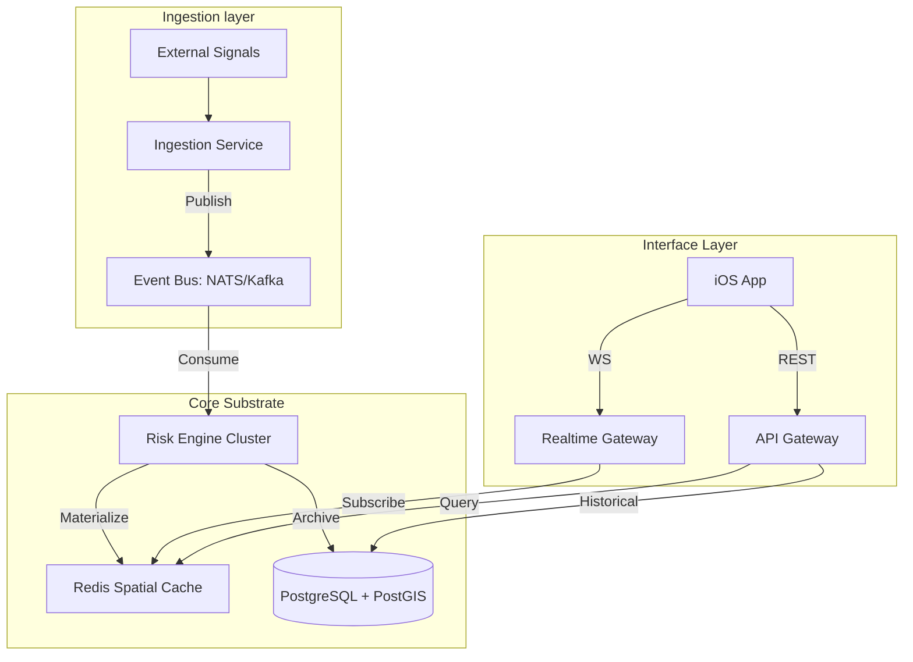

# UDIE Production Architecture & Implementation Blueprints

This document defines the professional-grade architecture for the UDIE (Urban Disruption Intelligence Engine) substrate, transitioning from a request-response model to a real-time, event-driven platform.

---

## 🏗 System Topology

The production system is designed for sub-500ms end-to-end latency, from signal ingestion to mobile visualization.



---

## 📂 Backend Folder Structure (NestJS Modules)

The production UDIE backend separates **domain logic, infrastructure, and transport layers** to ensure independent scalability and maintainability.

```text
engine-backend/
├── src/
│   ├── app.module.ts                # Root Dependency Graph
│   ├── main.ts                      # Cluster & Service Initialization
│   ├── config/                      # Configuration Layer
│   │   ├── configuration.ts         # Base Env mapping
│   │   ├── redis.config.ts          # Cache topology
│   │   ├── postgres.config.ts       # DB access & pooling
│   │   └── websocket.config.ts      # Pub/Sub adapter settings
│   ├── modules/                     # Domain Capabilities
│   │   ├── gateway/                 # WebSocket/SSE Realtime Stream
│   │   ├── city-dashboard/          # Urban Intelligence View
│   │   ├── risk/                    # Mathematical Risk Estimation
│   │   ├── ingestion/               # Signal Normalization & Validation
│   │   ├── events/                  # Event Persistence (Cold Storage)
│   │   ├── spatial/                 # H3 & PostGIS Geometry Utils
│   │   ├── sync/                    # Bootstrap & Delta Sync Logic
│   │   └── health/                  # System Heartbeat & Readiness
│   ├── infrastructure/              # External Adapters
│   │   ├── database/                # TypeORM / pg-client providers
│   │   ├── redis/                   # In-memory Grid Access (O(1))
│   │   ├── event-bus/               # Kafka/NATS Client
│   │   └── observability/           # Prom/Grafana Data Sinks
│   ├── workers/                     # Background Grid materializers
│   └── common/                      # Reusable Guards, Decorators, Utils
```

---

## ⚡️ Module Specifications

### 1. Gateway Module (Real-time)
Handles high-concurrency WebSocket streaming for live disruption feeds.
- **Responsibilities**: Region-based room management, event broadcasting, and reconnection recovery.
- **Protocol**: `Socket.io` with a Redis Adapter for cross-node message distribution.

### 2. Risk Module (Core Intelligence)
The technical heart of UDIE. Evaluates spatial field weights and calculates path risk density.
- **Responsibilities**: Route risk scoring (Douglas-Peucker + H3 coverage), exponential heat diffusion, and score normalization (v2 Spec).
- **Optimization**: All calculate calls are redirected to the **Spatial Cache** for sub-1ms response times.

### 3. Ingestion & Sync Modules
The bridge between external noise and system ground-truth.
- **Ingestion**: Parser -> Credibility Scoring -> Classification -> Event Bus Publish.
- **Sync**: Responsible for the **"Bootstrap + Stream"** protocol, handling delta updates since the last user sync.

---

## 🔄 Request & Event Lifecycles

### Route Risk Evaluation (REST)
1. **iOS** -> **API Gateway**.
2. **RiskService** fetches H3 polyline coverage.
3. **Spatial Cache (Redis)** provides MGET for all cell weights in O(1).
4. **Normalization Logic** computes final score.
5. **Response** sent back to mobile within **<100ms**.

### Disruption Propagation (Real-time)
1. **Signal** (e.g., Flood Tweet) detected.
2. **IngestionService** publishes to **EventBus**.
3. **RiskEngineWorker** updates the affected H3 cells in **Redis**.
4. **EventsGateway** broadcasts to all subscribers in that spatial region.
5. **Mobile UI** updates the map instantly.

---

## 🔄 Mobile Sync Protocol (Bootstrap + Stream)

To fix the "Not synced" issuespermanently, the mobile app follows this protocol:

1.  **Phase 1: Bootstrap (REST)**
    - Fetch `/health/ready` (Ensures substrate is alive).
    - Fetch `/api/v1/city-dashboard` (Populates the initial view).
    - Set `lastSyncTimestamp = server_time`.
2.  **Phase 2: Establish Stream (WS)**
    - Connect to `wss://api.udie.network`.
    - Join region rooms based on GPS coordinates.
3.  **Phase 3: Real-time Update (Delta)**
    - Receive `EVENT_ALIVE` or `RISK_UPDATE` packets.
    - Update the local `MapViewModel` state incrementally.

---

## 📈 Observability & Reliability

| Metric | Target | Warning Threshold |
| :--- | :--- | :--- |
| **Ingestion to Cache Latency** | < 250ms | > 1.0s |
| **Grid Query Time (O(1))** | < 5ms | > 20ms |
| **WebSocket Delivery** | < 100ms | > 500ms |
| **Platform Reliability Index** | > 0.99 | < 0.95 |
