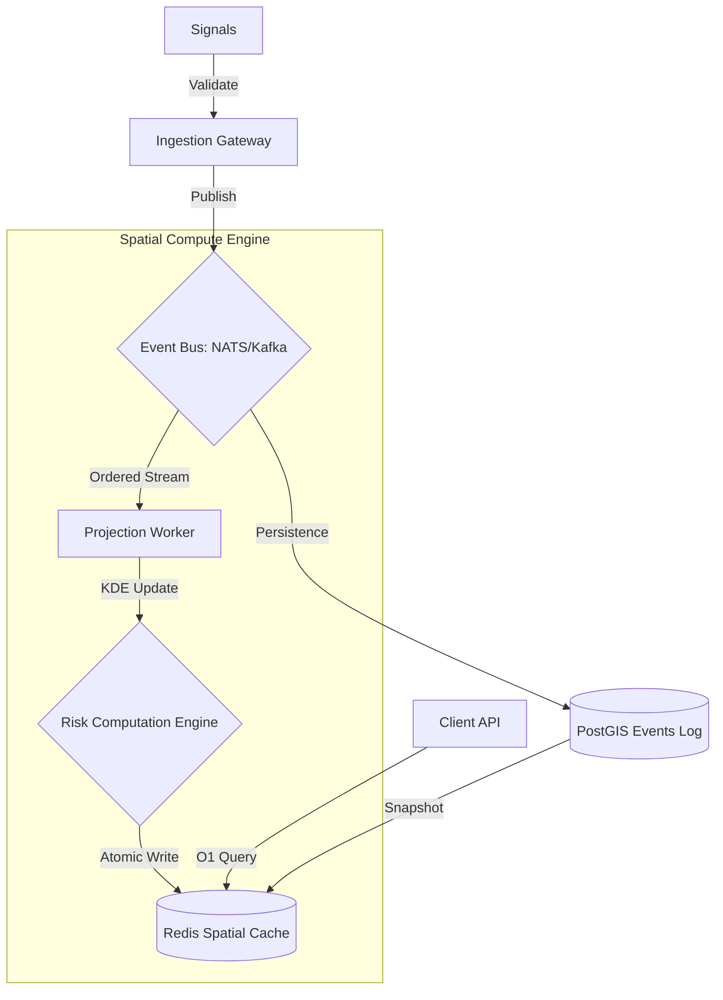

# UDIE System Workflow & Request Lifecycle (v2.1)

This document defines the high-concurrency request flow, event-driven semantics, and data invariants of the UDIE ecosystem.

---

## 🏗 Substrate Architecture & Event Flow

UDIE is an **Event-Sourced Spatial Compute Engine**. All system state is a projection of the immutable signal ledger.

---

## 📡 1. Event Stream Semantics (The Protocol)

To maintain **Deterministic Replayability** and system consistency, the event bus adheres to the following protocol:

### 1.1 Partitioning & Ordering
- **Partition Key**: `h3_index` (Res 6). 
- **Guarantee**: All signals for a specific geographic region are processed by the same worker instance. This ensures **Strong Ordering** for temporal decay and weight reinforcement within a spatial partition.

### 1.2 Delivery & Consistency
- **Semantics**: At-least-least-once delivery.
- **Idempotency**: Every signal carries a unique `fingerprint`. The `Projection Worker` performs a bloom-filter check (Redis-backed) before processing to prevent double-weighting in the risk field.
- **Consistency**: The system is **Eventually Consistent**. The `materialization_lag` metric tracks the delta between ingestion and grid update.

---

## 🧠 2. The Risk Computation Engine

The engine transforms discrete signals into a continuous spatiotemporal field.

### 2.1 Transformation Logic
1.  **Ingestion**: Receives a signal $(x, y, t, W)$.
2.  **Lookup**: Retrieve current cell weights for the signal's H3-ring (typically $k=3$).
3.  **Reinforcement**: $W_{new} = W_{current} + W_{signal} \cdot \exp(-\Delta t / \tau)$.
4.  **Decay Pulse**: Every `N` seconds, the engine applies a global decay factor to all active cells in the shard.

### 2.2 Redis Cache Model
- **Key**: `udie:risk:v1:<h3_index_res9>`
- **Value Type**: `SCALAR (Float32)` 
- **Optimization**: Pipelined atomic updates to minimize lock contention during high-intensity signal bursts.

---

## 🛡️ 3. Backpressure & Stability

To survive "Signal Storms" (e.g., massive urban crises), UDIE enforces:
1.  **Rate Limiting**: The `Ingestion Gateway` sheds load if the `Event Bus` backlog exceeds 10,000 pending signals.
2.  **Buffer Queues**: Workers use internal memory buffers to batch Redis writes.
3.  **Graceful Degradation**: If lag exceeds 5s, the system increases the aggregation resolution (e.g., Res 9 to Res 8) to reduce compute overhead.

---

## 🔄 4. Deterministic Replay Workflow

If the grid becomes corrupted:
1.  **Flush**: Clear the `Redis Spatial Cache`.
2.  **Replay**: The `Projection Worker` reads the `Events Log` sequentially by partition.
3.  **Parity**: Because update functions are idempotent and ordered by region, the resulting risk field is bit-for-bit identical to the pre-corrupted state.

---

MIT © 2026 **UDIE Engineering Group**. 
"One log, one truth, one city."
