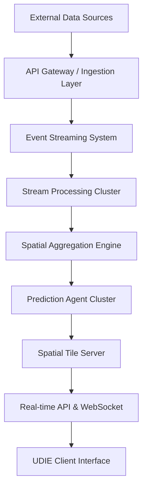

# UDIE System Deployment & Infrastructure Architecture (v1.0)

This document defines the **production infrastructure required to operate the Universal Disruption Intelligence Engine**.

The deployment architecture must support:
*   Real-time spatial intelligence
*   High-volume data ingestion
*   Distributed agent computation
*   Low-latency map rendering
*   High system reliability

---

## 1. Infrastructure Architecture Overview

UDIE follows a **distributed microservice architecture** deployed on container orchestration platforms.

### 1.1 System Topology

---

## 2. Cloud Deployment Model

Recommended environment: AWS, Google Cloud, or Azure.

### 2.1 Core Components
*   **Kubernetes cluster**: Managing containerized services.
*   **Managed Databases**: RDS/CloudSQL for Postgres.
*   **Managed Redis**: ElastiCache/MemoryStore.
*   **Managed Streaming**: Kinesis/PubSub.

---

## 3. Storage Architecture

UDIE uses **multi-tier storage** for operational efficiency.

### 3.1 Hot Storage (Redis)
Used for real-time risk scores and active trajectories.
*   **Latency Target**: < 5ms.

### 3.2 Relational Storage (Postgres + PostGIS)
System of record for events, cells, and agent states.
*   **H3 Partitioning**: Required for performance at scale.

### 3.3 Analytical Storage (ClickHouse/BigQuery)
Used for historical forensics and training displacement models.

---

## 4. Reliability Engineering (SRE)

### 4.1 Observability
*   **Prometheus**: Scraping NestJS `/metrics`.
*   **Grafana**: Visualization of spatial drift and model latency.
*   **OpenTelemetry**: Distributed tracing across agent steps.

### 4.2 Disaster Recovery
*   **RTO**: < 30 minutes.
*   **RPO**: < 5 minutes.
*   **Strategy**: Multi-region failover for the Ingestion layer.
